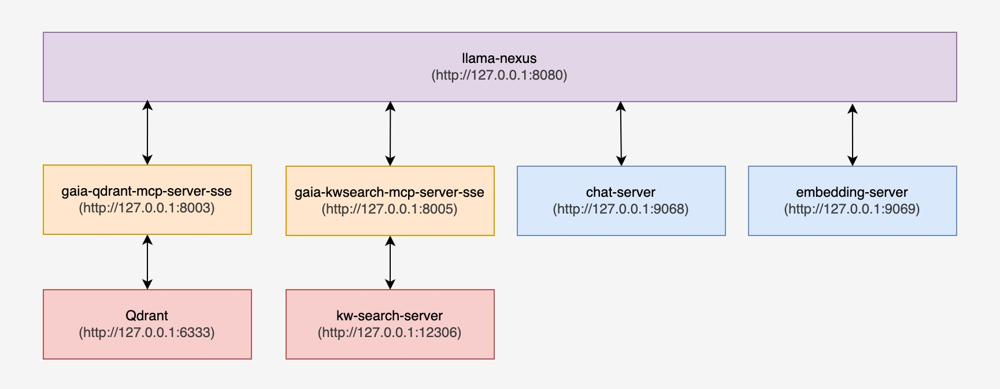

# Llama-nexus RAG Search: Configuration and Usage Guide

In RAG (Retrieval-Augmented Generation) scenarios, vector search and keyword search are two common search methods. llama-nexus supports both search methods through [Qdrant](https://qdrant.tech/) and [kw-search-server](https://github.com/LlamaEdge/kw-search-server). Additionally, llama-nexus also supports keyword search through [Elasticsearch](https://www.elastic.co/).

In this guide, we will use Qdrant and kw-search-server as examples to demonstrate:

- How to start llama-nexus in RAG mode along with related servers
- How to create embeddings and indexes for documents
- How to perform vector search and keyword search

## Table of Contents

- [Llama-nexus RAG Search: Configuration and Usage Guide](#llama-nexus-rag-search-configuration-and-usage-guide)
  - [Table of Contents](#table-of-contents)
  - [Starting llama-nexus and Related Servers](#starting-llama-nexus-and-related-servers)
    - [Configuring llama-nexus Startup Parameters](#configuring-llama-nexus-startup-parameters)
    - [Starting llama-nexus](#starting-llama-nexus)
  - [Creating Embeddings and Indices (Optional)](#creating-embeddings-and-indices-optional)
  - [Executing Search](#executing-search)
  - [Request Parameters for RAG Search](#request-parameters-for-rag-search)
    - [Parameters for Vector Search](#parameters-for-vector-search)
    - [Parameters for Keyword Search](#parameters-for-keyword-search)
    - [Additional Parameters](#additional-parameters)

## Starting llama-nexus and Related Servers

First, download the `llama-nexus` binary:

```bash
export NEXUS_VERSION=0.2.0

# macOS on Apple Silicon
curl -LO https://github.com/LlamaEdge/llama-nexus/releases/download/{$NEXUS_VERSION}/llama-nexus-apple-darwin-aarch64.tar.gz
tar -xvzf llama-nexus-apple-darwin-aarch64.tar.gz llama-nexus config.toml

# macOS on Intel
curl -LO https://github.com/LlamaEdge/llama-nexus/releases/download/{$NEXUS_VERSION}/llama-nexus-apple-darwin-x86_64.tar.gz
tar -xvzf llama-nexus-apple-darwin-x86_64.tar.gz llama-nexus config.toml

# Linux on x86_64
curl -LO https://github.com/LlamaEdge/llama-nexus/releases/download/{$NEXUS_VERSION}/llama-nexus-unknown-linux-gnu-x86_64.tar.gz
tar -xvzf llama-nexus-unknown-linux-gnu-x86_64.tar.gz llama-nexus config.toml

# Linux on aarch64
curl -LO https://github.com/LlamaEdge/llama-nexus/releases/download/{$NEXUS_VERSION}/llama-nexus-unknown-linux-gnu-aarch64.tar.gz
tar -xvzf llama-nexus-unknown-linux-gnu-aarch64.tar.gz llama-nexus config.toml
```

The extracted files include the `llama-nexus` binary and `config.toml` configuration file. Next, we'll configure the `config.toml` file.

### Configuring llama-nexus Startup Parameters

llama-nexus manages various configuration items through the `config.toml` file. The `[rag]` configuration section defines RAG-related settings. To enable RAG mode, simply set `enable` to `true`.

```toml
(Other configuration items)

[rag]
enable         = true
policy         = "last-user-message"
context_window = 1

(Other configuration items)
```

Similar to enabling RAG mode, you can enable the vector search MCP server by configuring the `[mcp.server.vector_search]` section in `config.toml`:

```toml
(Other configuration items)

[mcp.server.vector_search]
name      = "gaia-qdrant"
transport = "stream-http"
url       = "http://127.0.0.1:8003/mcp"
enable    = true

(Other configuration items)

```

### Starting llama-nexus

After configuring the startup parameters, follow these steps to start llama-nexus:

- Install WasmEdge Runtime

  - CPU Only

    ```bash
    # Version of WasmEdge Runtime
    export wasmedge_version="0.14.1"

    # Version of ggml plugin
    export ggml_plugin="b5593"

    # For CPU
    curl -sSf https://raw.githubusercontent.com/WasmEdge/WasmEdge/master/utils/install_v2.sh | bash -s -- -v $wasmedge_version --ggmlbn=$ggml_plugin
    ```

  - GPU

    ```bash
    # Version of WasmEdge Runtime
    export wasmedge_version="0.14.1"

    # Version of ggml plugin
    export ggml_plugin="b5593"

    # CUDA version: 11 or 12
    export ggmlcuda=12

    curl -sSf https://raw.githubusercontent.com/WasmEdge/WasmEdge/master/utils/install_v2.sh | bash -s -- -v $wasmedge_version --ggmlbn=$ggml_plugin --ggmlcuda=$ggmlcuda
    ```

- Start llama-api-server

  First, download `llama-api-server.wasm` and models:

  ```bash
  # Download llama-api-server.wasm
  export API_SERVER_VERSION=0.22.1
  curl -LO https://github.com/LlamaEdge/LlamaEdge/releases/download/{$API_SERVER_VERSION}/llama-api-server.wasm

  # Download chat model
  curl -LO https://huggingface.co/second-state/Qwen3-4B-GGUF/resolve/main/Qwen3-4B-Q5_K_M.gguf

  # Download embedding model
  curl -LO https://huggingface.co/second-state/nomic-embed-text-v1.5-GGUF/resolve/main/nomic-embed-text-v1.5-f16.gguf
  ```

  Then, start the chat and embedding servers:

  ```bash
  # start chat server
  wasmedge --dir .:. --nn-preload default:GGML:AUTO:Qwen3-4B-Q5_K_M.gguf \
  llama-api-server.wasm \
  --model-name Qwen3-4B \
  --prompt-template qwen3-no-think \
  --ctx-size 8192 --port 9068

  # start embedding server
  wasmedge --dir .:. --nn-preload default:GGML:AUTO:nomic-embed-text-v1.5-f16.gguf \
  llama-api-server.wasm \
  --prompt-template embedding \
  --ctx-size 768 \
  --model-name nomic-embed-text-v1.5 --port 9069
  ```

  If started successfully, the chat server and embedding server will run on ports `9068` and `9069` respectively.

- Start MCP servers

  First, download `gaia-qdrant-mcp-server` and `gaia-kwsearch-mcp-server` binaries:

  ```bash
  export GAIA_MCP_VERSION=0.4.0

  # macOS on Apple Silicon
  curl -LO https://github.com/decentralized-mcp/gaia-mcp-servers/releases/download/{$GAIA_MCP_VERSION}/gaia-mcp-servers-apple-darwin-aarch64.tar.gz
  tar -xvzf gaia-mcp-servers-apple-darwin-aarch64.tar.gz gaia-qdrant-mcp-server gaia-kwsearch-mcp-server

  # macOS on Intel
  curl -LO https://github.com/decentralized-mcp/gaia-mcp-servers/releases/download/{$GAIA_MCP_VERSION}/gaia-mcp-servers-apple-darwin-x86_64.tar.gz
  tar -xvzf gaia-mcp-servers-apple-darwin-x86_64.tar.gz gaia-qdrant-mcp-server gaia-kwsearch-mcp-server

  # Linux on x86_64
  curl -LO https://github.com/decentralized-mcp/gaia-mcp-servers/releases/download/{$GAIA_MCP_VERSION }/gaia-mcp-servers-linux-unknown-gnu-x86_64.tar.gz
  tar -xvzf gaia-mcp-servers-linux-unknown-gnu-x86_64.tar.gz gaia-qdrant-mcp-server gaia-kwsearch-mcp-server

  # Linux on aarch64
  curl -LO https://github.com/decentralized-mcp/gaia-mcp-servers/releases/download/{$GAIA_MCP_VERSION}/gaia-mcp-servers-linux-unknown-gnu-aarch64.tar.gz
  tar -xvzf gaia-mcp-servers-linux-unknown-gnu-aarch64.tar.gz gaia-qdrant-mcp-server gaia-kwsearch-mcp-server
  ```

  Then, start the MCP servers. Assume that the index named `paris-index-01` is existing in kw-search-server. To create the index, please refer to the [Creating Embeddings and Indices (Optional)](#creating-embeddings-and-indices-optional) section.

  ```bash
  # Start gaia-qdrant mcp server
  ./gaia-qdrant-mcp-server

  # Start gaia-keyword-search mcp server
  ./gaia-kwsearch-mcp-server --index paris-index-01 --transport stream-http
  ```

  If started successfully, the `gaia-qdrant` and `gaia-keyword-search` MCP servers will run on ports `8003` and `8005` respectively.

  Note: The `gaia-qdrant` and `gaia-keyword-search` MCP servers will access Qdrant and kw-search-server respectively when performing searches. Ensure that Qdrant and kw-search-server are properly started and running on their default ports `6333` and `12306`:

  <details><summary>Expand to view the steps to deploy Qdrant and kw-search-server</summary>

  - Deploy and Start Qdrant Locally

    First, download the latest Qdrant image from Dockerhub:

    ```bash
    docker pull qdrant/qdrant
    ```

    Then, run the service:

    ```bash
    docker run -p 6333:6333 -p 6334:6334 \
        -v "$(pwd)/qdrant_storage:/qdrant/storage:z" \
        qdrant/qdrant
    ```

  - Deploy and Start kw-search-server Locally

    First, download the `kw-search-server` binary:

    ```bash
    export KW_SERVER_VERSION=0.2.0

    # macOS on Apple Silicon
    curl -LO https://github.com/LlamaEdge/kw-search-server/releases/download/{$KW_SERVER_VERSION}/kw-search-server-aarch64-apple-darwin.tar.gz
    tar -xvzf kw-search-server-aarch64-apple-darwin.tar.gz kw-search-server

    # macOS on Intel
    curl -LO https://github.com/LlamaEdge/kw-search-server/releases/download/{$KW_SERVER_VERSION}/kw-search-server-x86_64-apple-darwin.tar.gz
    tar -xvzf kw-search-server-x86_64-apple-darwin.tar.gz kw-search-server

    # Linux on x86_64
    curl -LO https://github.com/LlamaEdge/kw-search-server/releases/download/{$KW_SERVER_VERSION}/kw-search-server-x86_64-unknown-linux-gnu.tar.gz
    tar -xvzf kw-search-server-x86_64-unknown-linux-gnu.tar.gz kw-search-server

    # Linux on aarch64
    curl -LO https://github.com/LlamaEdge/kw-search-server/releases/download/{$KW_SERVER_VERSION}/kw-search-server-aarch64-unknown-linux-gnu.tar.gz
    tar -xvzf kw-search-server-aarch64-unknown-linux-gnu.tar.gz kw-search-server
    ```

    Then, run the service:

    ```bash
    # Run
    ./kw-search-server
    ```

    If started successfully, kw-search-server will run on port `12306` by default.

  </details>

- Start llama-nexus

  ```bash
  ./llama-nexus
  ```

  If started successfully, llama-nexus will run on port `3389` by default.

- Register chat and embedding servers

  ```bash
  # Register chat server
  curl --location 'http://localhost:3389/admin/servers/register' \
  --header 'Content-Type: application/json' \
  --data '{
      "url": "http://localhost:9068",
      "kind": "chat"
  }'

  # Register embedding server
  curl --location 'http://localhost:3389/admin/servers/register' \
  --header 'Content-Type: application/json' \
  --data '{
      "url": "http://localhost:9069",
      "kind": "embeddings"
  }'
  ```

At this point, llama-nexus and related servers are successfully started. The topology diagram is as follows:

<div align="center">
  
</div>

Next, we'll create embeddings and indexes for documents.

## Creating Embeddings and Indices (Optional)

Before performing vector search and keyword search, you need to create embeddings and indexes for your documents. Embeddings will be stored in Qdrant, while indexes will be used by kw-search-server. llama-nexus provides the `/v1/create/rag` endpoint for creating embeddings and indexes for documents.

> [!NOTE]
> The `/v1/create/rag` endpoint currently only supports persisting embeddings in Qdrant and creating indexes for kw-search-server. Support for Elasticsearch will be added in the near future.

<details><summary>Expand to view the details of creating embeddings and indices</summary>

The CURL command below sends a request to `llama-nexus`, which performs the following tasks in sequence:

- Segments [paris.txt]() into chunks, with each chunk containing 150 words
- Creates an index named `paris-index-01` in `kw-search-server` running on `http://localhost:12306`
- Computes embeddings for the chunks and persists them to the collection named `paris-01` in Qdrant server running on `http://localhost:6333`

```bash
# Create embeddings and index
curl --location 'http://localhost:3389/v1/create/rag' \
--header 'Content-Type: multipart/form-data' \
--form 'file=@"paris.txt"' \
--form 'chunk_capacity="150"' \
--form 'vdb_server_url="http://localhost:6333"' \
--form 'vdb_collection_name="paris-01"' \
--form 'kw_search_url="http://localhost:12306"' \
--form 'kw_search_index_name="paris-index-01"'
```

If the request is processed successfully, a response similar to the following will be returned:

```bash
{
    "index": {
        "index_name": "paris-index-01",
        "results": [
            {
                "status": "indexed"
            },
            {
                "status": "indexed"
            },
            {
                "status": "indexed"
            },
            {
                "status": "indexed"
            },
            {
                "status": "indexed"
            },
            {
                "status": "indexed"
            },
            {
                "status": "indexed"
            },
            {
                "status": "indexed"
            },
            {
                "status": "indexed"
            },
            {
                "status": "indexed"
            },
            {
                "status": "indexed"
            },
            {
                "status": "indexed"
            },
            {
                "status": "indexed"
            },
            {
                "status": "indexed"
            },
            {
                "status": "indexed"
            },
            {
                "status": "indexed"
            },
            {
                "status": "indexed"
            },
            {
                "status": "indexed"
            },
            {
                "status": "indexed"
            },
            {
                "status": "indexed"
            },
            {
                "status": "indexed"
            },
            {
                "status": "indexed"
            }
        ]
    },
    "vdb": "Collection `paris-01` created successfully."
}
```

</details>

At this point, we have created embeddings and indexes for the documents. Next, we can perform vector search and keyword search.

## Executing Search

When llama-nexus is running in RAG mode with `gaia-qdrant` and `gaia-keyword-search` MCP servers enabled, sending a chat completion request will trigger vector search and keyword search.

The CURL command below sends a chat completion request to `llama-nexus`. Note: If your llama-nexus is running on a port other than `3389`, please update the port number in the request.

```bash
curl --location 'http://localhost:3389/v1/chat/completions' \
--header 'Content-Type: application/json' \
--data '{
    "model": "Qwen3-4B",
    "messages": [
        {
            "role": "system",
            "content": "You are a helpful assistant. Answer questions as concisely as possible."
        },
        {
            "role": "user",
            "content": "What is the location of Paris, France along the Seine river?"
        }
    ],
    "kw_search_mcp_tool": {
        "type": "mcp",
        "server_label": "gaia-kwsearch-mcp-server",
        "server_url": "http://127.0.0.1:8005/mcp",
        "transport": "stream-http"
    },
    "vdb_collection_name": ["paris-01"],
    "limit": 5,
    "score_threshold": 0.5,
}'
```

After processing, llama-nexus will return a response similar to:

```bash
{
    "id": "chatcmpl-49caad8c-24ee-4425-bae5-cbe7fc5dc8a8",
    "object": "chat.completion",
    "created": 1747733116,
    "model": "Qwen3-4B",
    "choices": [
        {
            "index": 0,
            "message": {
                "content": "Paris, France is located along the Seine River, approximately 233 miles (375 km) upstream from the river's mouth.",
                "role": "assistant"
            },
            "finish_reason": "stop",
            "logprobs": null
        }
    ],
    "usage": {
        "prompt_tokens": 285,
        "completion_tokens": 34,
        "total_tokens": 319
    }
}
```

## Request Parameters for RAG Search

In addition to parameters compatible with the OpenAI API such as `model` and `messages`, the `/v1/chat/completions` endpoint includes the following parameters for controlling RAG search:

### Parameters for Vector Search

- Parameters for Qdrant
  - `vdb_collection_name`: Name of the Qdrant collection used for vector search

<details><summary>Expand to view example request</summary>

```bash
curl --location 'http://localhost:3389/v1/chat/completions' \
--header 'Content-Type: application/json' \
--data '{
    "messages": [
        {
            "role": "user",
            "content": "What is the location of Paris, France along the Seine river?"
        }
    ],
    "vdb_collection_name": ["dummy-vector-search-index-name"],
    "model": "Qwen3-4B",
}'
```

</details>

### Parameters for Keyword Search

- Parameters for [kw-search-server](https://github.com/LlamaEdge/kw-search-server)

  ```bash
  curl --location 'http://localhost:3389/v1/chat/completions' \
  --header 'Content-Type: application/json' \
  --data '{
      "messages": [
          {
              "role": "user",
              "content": "What is the location of Paris, France along the Seine river?"
          }
      ],
      "kw_search_mcp_tool": {
        "type": "mcp",
        "server_label": "gaia-kwsearch-mcp-server",
        "server_url": "http://127.0.0.1:8005/mcp",
        "transport": "stream-http"
      },
      "model": "Qwen3-4B",
  }'
  ```

  Also see [README of gaia-kwsearch-mcp-server](https://github.com/decentralized-mcp/gaia-mcp-servers/blob/main/gaia-kwsearch/README.md) for the MCP server side configuration details.

- Parameters for Elasticsearch

  ```bash
  curl --location 'http://localhost:3389/v1/chat/completions' \
  --header 'Content-Type: application/json' \
  --data '{
      "messages": [
          {
              "role": "user",
              "content": "What is the location of Paris, France along the Seine river?"
          }
      ],
      "kw_search_mcp_tool": {
        "type": "mcp",
        "server_label": "gaia-elastic-mcp-server",
        "server_url": "http://127.0.0.1:8006/mcp",
        "transport": "stream-http"
      },
      "model": "Qwen3-4B",
  }'
  ```

  Also see [README of gaia-elastic-mcp-server](https://github.com/decentralized-mcp/gaia-mcp-servers/blob/main/gaia-elastic/README.md) for the MCP server side configuration details.

- Parameters for TiDB

  ```bash
  curl --location 'http://localhost:3389/v1/chat/completions' \
  --header 'Content-Type: application/json' \
  --data '{
      "messages": [
          {
              "role": "user",
              "content": "What is the location of Paris, France along the Seine river?"
          }
      ],
      "kw_search_mcp_tool": {
        "type": "mcp",
        "server_label": "gaia-tidb-mcp-server",
        "server_url": "http://127.0.0.1:8007/mcp",
        "transport": "stream-http"
      },
      "model": "Qwen3-4B",
  }'
  ```

  Also see [README of gaia-tidb-mcp-server](https://github.com/decentralized-mcp/gaia-mcp-servers/blob/main/gaia-tidb/README.md) for the MCP server side configuration details.

### Additional Parameters

- `limit`: The maximum number of results to return.
- `score_threshold`: The score threshold for vector search and keyword search results.
- `weighted_alpha`: When vector search and keyword search find the same result, this parameter is used to weight their respective scores to obtain the final score for that result. The value range of `weighted_alpha` is `[0, 1]`, with a default value of `0.5`. The calculation formula is:

  ```text
  final_score = weighted_alpha * keyword_score + (1 - weighted_alpha) * vector_score
  ```

<details><summary>Expand to view example request</summary>

```bash
curl --location 'http://localhost:3389/v1/chat/completions' \
--header 'Content-Type: application/json' \
--data '{
    "messages": [
        {
            "role": "user",
            "content": "What is the location of Paris, France along the Seine river?"
        }
    ],
    "kw_search_mcp_tool": {
        "type": "mcp",
        "server_label": "gaia-kwsearch-mcp-server",
        "server_url": "http://127.0.0.1:8005/mcp",
        "transport": "stream-http"
    },
    "vdb_collection_name": [
        "dummy-vector-search-index-name"
    ],
    "limit": 5,
    "score_threshold": 0.5,
    "weighted_alpha": 0.3,
    "model": "Qwen3-4B",
}'
```

</details>
