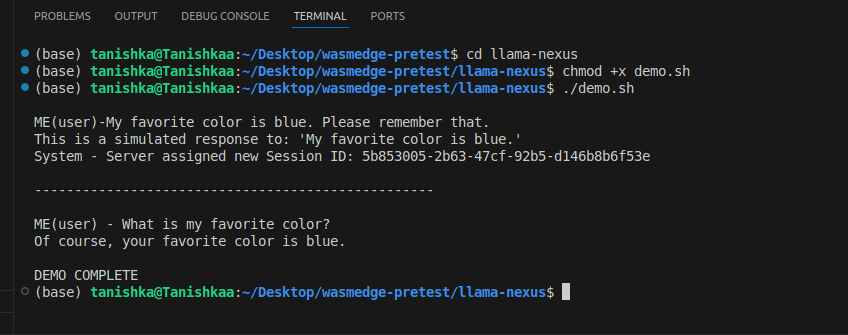

# LFX Mentorship Pre-Test: Support for the /responses API

This document details the successful completion of the pre-test requirements for the Llama Nexus project.

## Pre-Test 1: Fork the Project

**Status: Completed.**


## Pre-Test 2: Implement the `/responses` API

**Status: Completed.**

A stateful `/responses` API endpoint has been implemented to simulate OpenAI's older Responses API. The implementation constructs a complete system prompt and chat history for each user request.

### Technical Implementation

*   **Endpoint:** A new API route, `POST /responses`, has been added to the Axum router in `src/main.rs`.
*   **Database:** A local SQLite database (`chat_history.db`) is used for persistence. The `rusqlite` crate (with the `bundled` feature for easy setup) was added as a dependency. All database logic is encapsulated in the `src/database.rs` module.
*   **Session Management:**
    *   Conversational context is maintained using an `X-Session-ID` header.
    *   If a request is received **without** the header, a new `UUIDv4` is generated to serve as the session ID, starting a new conversation.
    *   If the header **is present**, the corresponding chat history is retrieved from the database.
*   **Context Construction:** For every request, a full list of messages is constructed in memory, consisting of a hardcoded system prompt, the historical messages from the database, and the new user message.
*   **Simulated AI:** The downstream LLM call is simulated with simple hardcoded logic in the `responses_handler` function. This allows the state management infrastructure to be tested in isolation, proving its correctness without requiring a live LLM.

---

## Pre-Test 3: Provide Docs and Demo

**Status: Completed.**

This document and the `demo.sh` script fulfill this requirement.

### How to Run the Demo and Verify the Solution

The `demo.sh` script provides an automated, end-to-end test of the feature.

**Prerequisites:**
*   The `jq` command-line JSON processor must be installed (`sudo apt-get install jq` or `brew install jq`).

**Steps:**

1.  **Start the Server:** Open a terminal in the project root and run the server.
    ```bash
    cargo run
    ```
    The server will start and listen on a specific port.

2.  **Run the Demo Script:** Open a **second terminal** in the same project directory. Ensure the `PORT` variable inside `demo.sh` matches the port from Step 1, then run the script:
    ```bash
    ./demo.sh
    ```

### Expected Output

The script will simulate a two-part conversation. The output will look like this, proving the API is stateful:

